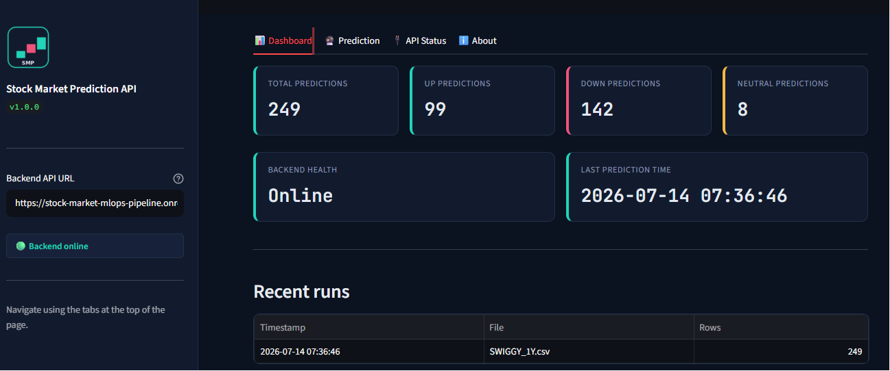
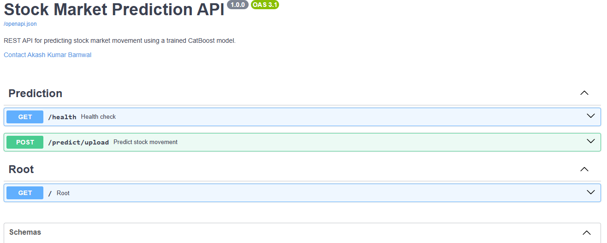
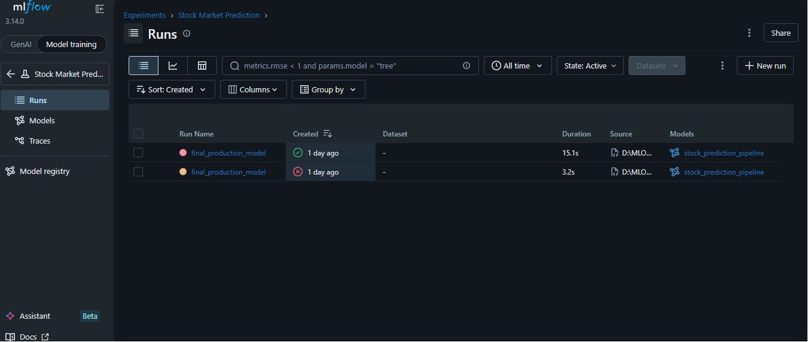
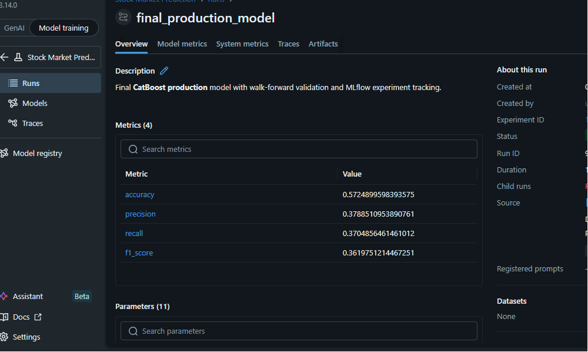

# 📈 Stock Market Prediction MLOps Pipeline

> An end-to-end production-ready MLOps pipeline for multi-class stock movement prediction using CatBoost, FastAPI, Streamlit, DVC, MLflow, Docker, GitHub Actions, and Render.

<p align="center">


</p>

---

# 🌐 Live Demo

| Service | URL |
|---------|-----|
| 🎯 Streamlit Dashboard | https://stock-market-mlops-pipeline.onrender.com|
| ⚡ FastAPI API | https://stock-market-mlops-pipeline-1.onrender.com/ |
| 📘 Swagger UI |https://stock-market-mlops-pipeline.onrender.com/docs |


---

# ⭐ Features

- End-to-end MLOps pipeline
- Time-series feature engineering
- Walk-forward validation
- CatBoost multi-class classifier
- MLflow experiment tracking
- DVC model versioning
- FastAPI REST API
- Streamlit Dashboard
- Dockerized deployment
- GitHub Actions CI/CD
- Automatic Render deployment

---

# 🏗 Architecture

```text
Dataset
   │
   ▼
Data Ingestion
   │
   ▼
Data Validation
   │
   ▼
Feature Engineering
   │
   ▼
Model Training
   ├── Walk Forward Validation
   ├── Early Stopping
   ├── Final Retraining
   ├── MLflow Tracking
   └── DVC Versioning
   │
   ▼
FastAPI Backend
   │
   ▼
Streamlit Dashboard
```

---

# 📊 Model Performance

| Metric | Score |
|--------|------:|
| Accuracy | **57.25%** |
| Precision | **37.89%** |
| Recall | **37.05%** |
| F1 Score | **36.20%** |

---

# 📸 Project Screenshots

## Streamlit Dashboard



---

## FastAPI Swagger UI



---

## MLflow Experiment Tracking



---

## MLflow Run Details



---

# 📂 Project Structure

```text
.
├── .github/
├── app/
├── config/
├── frontend_streamlit/
├── reports/
├── requirements/
├── src/
├── Dockerfile.backend
├── Dockerfile.frontend
├── docker-compose.yml
├── README.md
```

---

# ⚙️ Installation

```bash
git clone <repository-url>

cd Stock-Market-MLOps-Pipeline

python -m venv venu

# Windows
venu\Scripts\activate

pip install -r requirements/backend.txt
pip install -r requirements/frontend.txt
```

---

# 🚀 Training

```bash
python training_pipeline.py
```

Pipeline:

1. Data Ingestion
2. Data Validation
3. Feature Engineering
4. Walk-forward Validation
5. Final Model Training
6. Model Evaluation
7. MLflow Logging
8. DVC Versioning

---

# 📊 MLflow

```bash
mlflow ui --backend-store-uri sqlite:///mlflow.db
```

Open:

```
http://127.0.0.1:5000
```

Tracks:

- Parameters
- Metrics
- Artifacts
- Models

---

# 📦 DVC

```bash
dvc add models

git add models.dvc

git commit -m "Update trained model"

dvc push
```

---

# 🐳 Docker

```bash
docker compose up --build
```

Backend → 8000

Frontend → 8501

---

# 🔌 FastAPI

```bash
uvicorn app.main:app --reload
```

Swagger:

```
http://127.0.0.1:8000/docs
```

---

# 💻 Streamlit

```bash
streamlit run frontend_streamlit/streamlit_app.py
```

---

# 🔄 CI/CD Pipeline

```text
Developer
      │
      ▼
GitHub Repository
      │
      ▼
GitHub Actions
      │
      ├── Black
      ├── isort
      ├── Flake8
      ├── MyPy
      ├── Pytest
      │
      ▼
Render Deployment
      ├── Backend
      └── Frontend
```

---

# 🔮 Future Improvements

- FinBERT sentiment analysis
- SHAP explainability
- Optuna hyperparameter tuning
- Model monitoring
- Data drift detection
- Concept drift detection
- Scheduled retraining
- Kubernetes deployment

---

# 👨‍💻 Author

**Akash Kumar Barnwal**

- 🎓 M.Sc. Artificial Intelligence & Machine Learning, IIIT Lucknow
- 💻 GitHub: https://github.com/barnwalakash60973-pixel
- 🔗 LinkedIn: https://www.linkedin.com/in/akash-kumar-barnwal-31968a380/

---

# 📄 License

MIT License